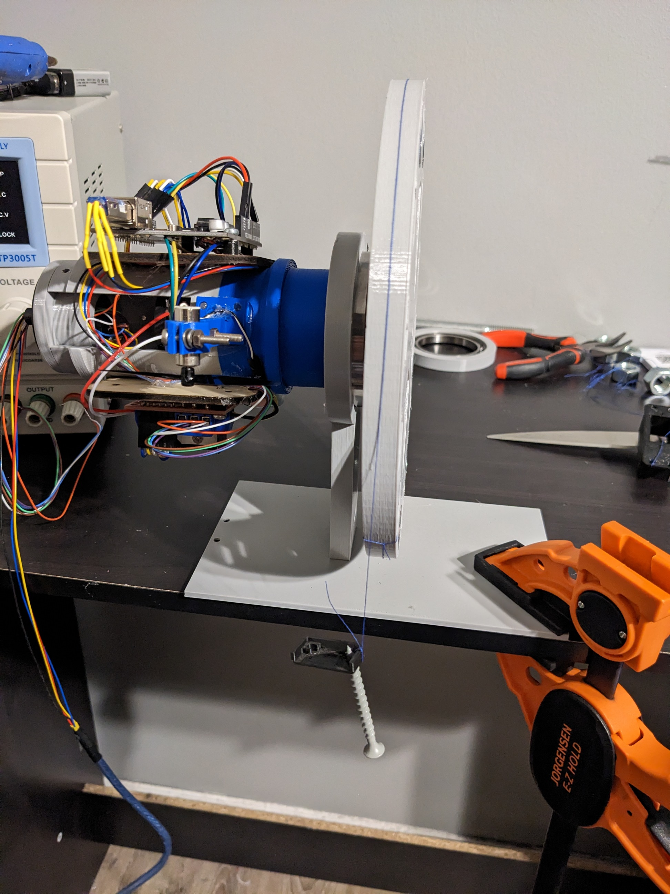
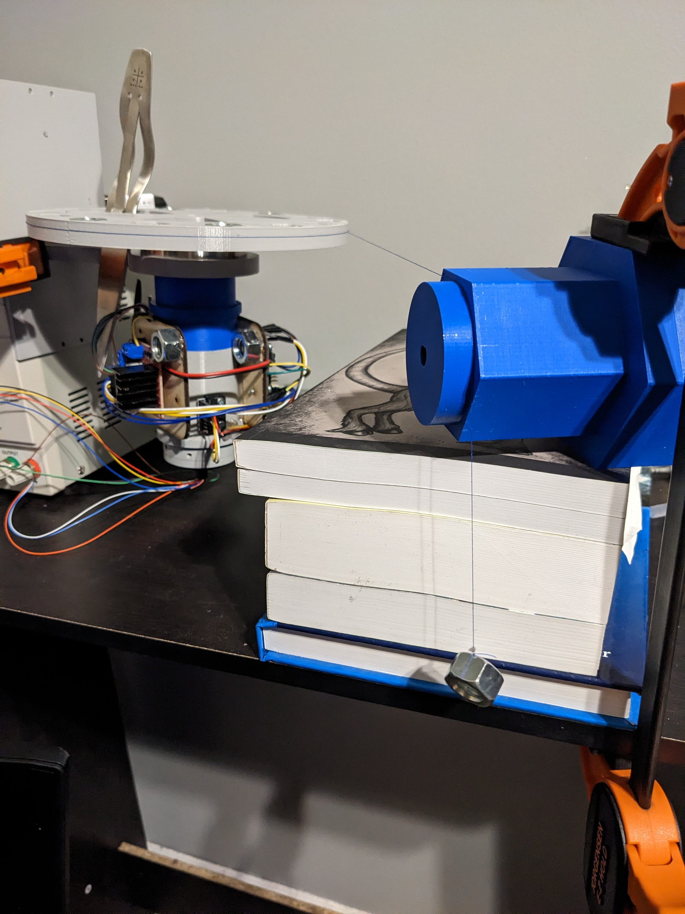

# Reaction Wheel Doc Brainstorm

## Reaction Wheel Proj Goals
- Emulate a design, testing and tuning process for a reaction wheel attitude control system
- For manufacturing simplicity system is kept as a 1D attitude control problem
- An offset weight acting as a pendulum acts as a constant disturbance, saturating the reaction mass
### Technical documentation of the system
  - Electronic components
  - Firmware components
  - GUI
  - Device communication
  - Mechanical Components
### Experimental System Identification
  - GUI provides great method to generate data and run various types of tests
  - Caveats of the design the diverge from true sattelite system
    - Slip-ring and bearing friction, orders of magnitude more drag than differential gravity drag
#### How to get inertia of the system without individually measuring the inertia of separate elemnts
- "Sattelite" portion
- Inertia Wheel portion
  - Inluding gears, rotor, and reaction mass
- Estimate "Inertia Ratio" and "Total Inertia"
  - Const torque applied (from nut on string) -> angular acceration gives Inertia
  - Fix sattelite portion of system, Step input test motor to get angular impulse applied to wheel
  - Free sattelite portion, step input motor, get angular velocity of the wheel and sattelite (using encoder (for sat portion) and encoder for wheel angular velocity in sat frame)
  - Manually process the data to find quality filtering that with clever assumptions would provide a good estimate of the inertia of the wheel vs the sattelite
  - Removing Frition from the model
    - Use nut on string data to estimate friction from bearing and slip ring  

    - This setup had some issues because of the off-center mass which caused an oscillation in the data due to gravity  

      - This setup prevented/minimized the oscillations due to gravity
      - System spins up from acceleration due to nut
      - When nut hits the ground the only applied torque is due to friction
      - Use angular acceleration to get a "drag coefficient" since we don't know Inertia yet
      - Forward simulate the nut test with the "drag coefficient" removed to estimate angular acceleration
      - Now we can use tau = I*alpha since alpha will be larger from the friction removal
  - Comparison of python estimation methods and manual estimation methods
## MATLAB/Simulink Model
  - Cascade PID controller
  - Friction model esetimate
  - Reaction mass angular momentum saturation
  - PID Tuner for gain estimation
  - Arduino Firmware qualification that it's control is represented fairly
    - Apply ODrive tuning method to system starting with Simlink gains as a starting point
## Future Considerations
  - Replace Arduino with pico_w for wireless
  - Battery instead of power supply
  - Remove slipring to minimize friction
  - Make system 2D (pitch, yaw) and have it track the sun
    - Use accelerometer to get gravity vector
    - Magnetometer for North vector
    - Use Lookuptable or the like to get sun position relative
    - Use a set of light sensors to aid in orientation (maybe computer vision)
    - Sensor fusion of Magnetometer, Gravity vector, and light sensors/cv to track sun
  - Make system use CMG instead of reaction wheel
  - Design a spherical ball joint to minimize friction and simplify the mechanism complexity
    - Use ball bearings in a similar fashion to a ball screw

## GIFs of Stability under disturbance
- Desaturation of wheel
- Disturbance rejection 
- Tracker Analysis